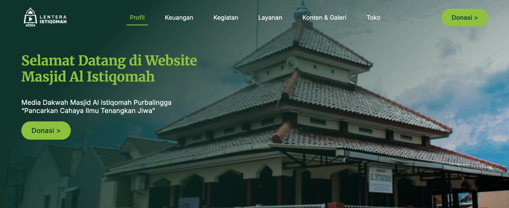

# Website Masjid Al Istiqomah

Website landing page sederhana untuk Masjid Al Istiqomah Purbalingga. Dibuat sebagai bagian dari perjalanan belajar web development saya menggunakan HTML, CSS, dan JavaScript. Website ini menyajikan informasi seputar kegiatan masjid, donasi, kajian, artikel, serta laporan keuangan secara sederhana dan mudah diakses.

## 🌐 Demo Langsung

Lihat versi online di:  
[https://masjid-al-istiqomah.netlify.app](https://masjid-al-istiqomah.netlify.app)

## 🎖️ Badge

  
  
[](https://app.netlify.com/sites/masjid-al-istiqomah/deploys)

## 📸 Cuplikan Tampilan



## 📌 Fitur Utama

- Tombol Donasi
- Jadwal Shalat Harian
- Laporan Keuangan Masjid
- Jadwal dan Informasi Kegiatan
- Kajian & Artikel Keislaman
- Formulir Kontak
- Desain responsif untuk berbagai perangkat

## 🛠️ Teknologi yang Digunakan

- HTML5 untuk struktur halaman
- CSS3 (Flexbox & Grid) untuk styling dan layout
- JavaScript dasar untuk interaktivitas

## 📖 Perjalanan Belajar

Proyek ini dibuat untuk melatih dan memperdalam pemahaman saya dalam:

1. Menyusun struktur halaman HTML yang rapi dan semantik
2. Mendesain tampilan yang bersih dan responsif
3. Menambahkan interaksi sederhana menggunakan JavaScript
4. Menyampaikan informasi secara jelas untuk komunitas masjid

### Tantangan yang Dihadapi

- Membuat tampilan tetap rapi di layar kecil (responsif)
- Menyusun informasi kegiatan dan laporan dengan cara yang mudah dipahami
- Menata konten agar tidak terlalu padat tapi tetap informatif

## 🚀 Cara Menjalankan Secara Lokal

1. Clone repo ini:
   ```bash
   git clone https://github.com/AsrilSyahputra/Masjid-Al-Istiqomah.git
